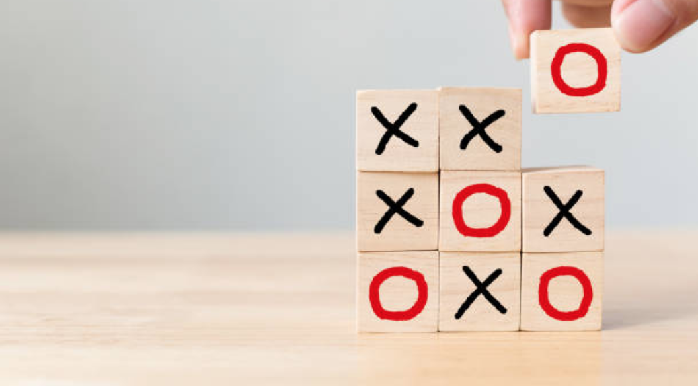
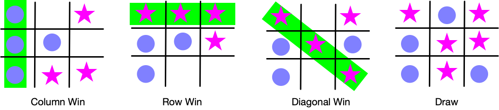

# Tic Tac Toe

## Suggestion for rules and description.

* In Tic Tac Toe Game, the gentle alternative is to design a two-player game, where the developer gets input from two players.

* The following combination of players must be taken into consideration:
1. Human vs Human (they play in their computer at different places)
2. Human vs Machine 

* If we consider the 2nd combination, The computer can select a position randomly. The machine could be addressed further improvement using AI and ML algorithm for establishing a tough match.

* Create the UI by explaining them the current status of the Tic Tac Toe Game board and then direct them to give a position as input.

* Description of the selection

If Game is complete, then determine the winner or verify if the game is in a draw.

In this game, There are Three way of selections in a row  

* **Horizontal**

* **Vertical**   

* **Diagonal**

Draw - All the options are selected with no player having three selections in a row   