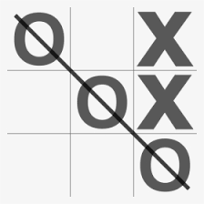
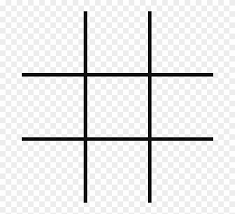
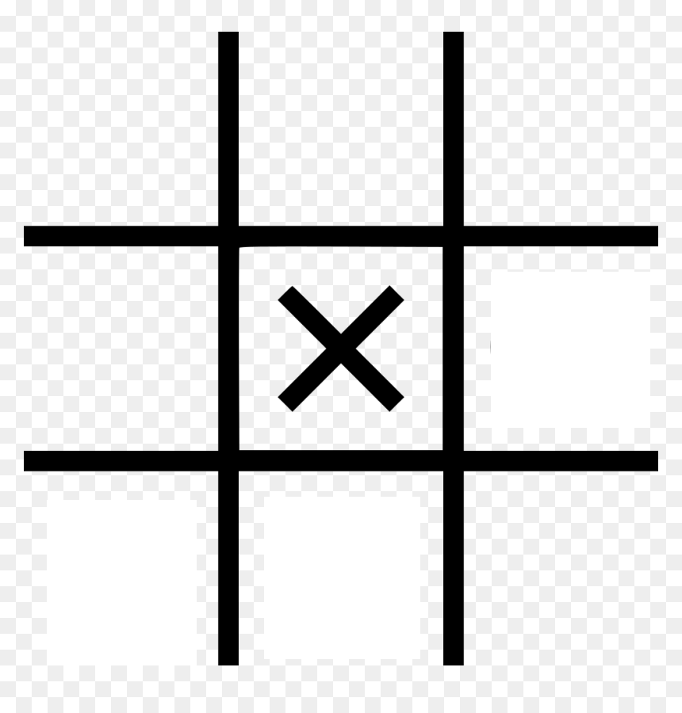
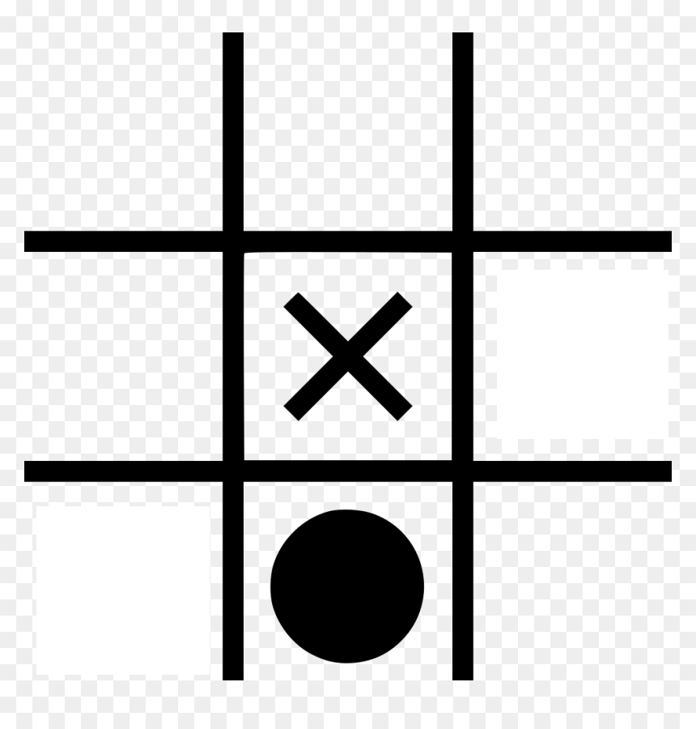

## Tic-Tac-Toe
Tic-Tac-Toe is a simple and brain-friendly multiplayer game.

## Gameplay
* The goal of tic-tac-toe is to be the first player to get three in a row on a 3-by-3 grid.

**like this**  here **"O"** is the winner  

* Part of  game is trying to figure out how to get three **X** in a row. Then trying to Stop Another Player or computer from getting three **O** in a row.

* After you put an **X** in a square, you start looking ahead. Where's the best place for your next **X**? You look at the empty squares and decide which ones are good choices which ones might let you make three **X**s in a row.

* The first player to get 3 of her marks in a row 
       1. up 
       2. down
       3. across  
       4. diagonally 
    is the Winner.   

* All the squares are full, then no player get 3 in row, the game is ends in tie.

## Steps
1. **Step 1:** The first step up the empty board. then choose which player starts the first move and and who takes **x** and **O**.

2. **Step 2:** Start the game with the first move of player1. in tic tac toe Which player makes the first move Mostly the win percentage is high for him.

3. **Step 3:** Then alternatively give chance to player2. Carefully makes their first move is important for player2.

4.  **Step 3:** Keep alternating moves until one of the players has stricks a row of three symbols otherwise, no one wins a game is a tie match.

**ex: it is tie** 

**ex: it is win** 

